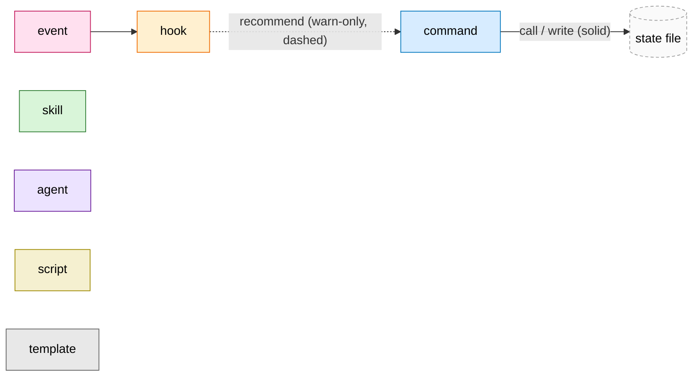
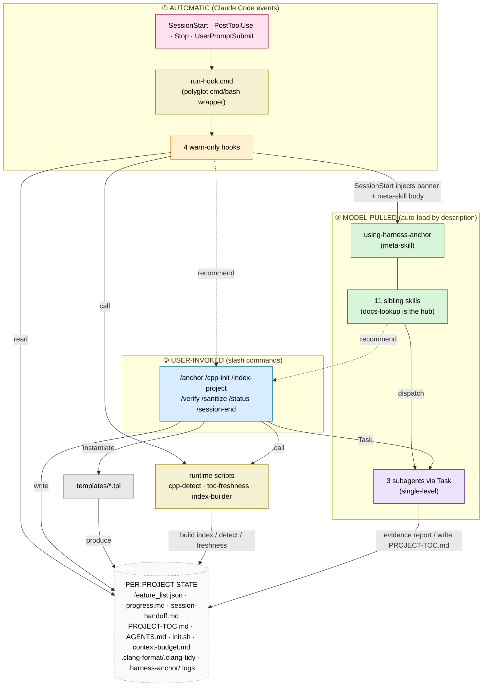
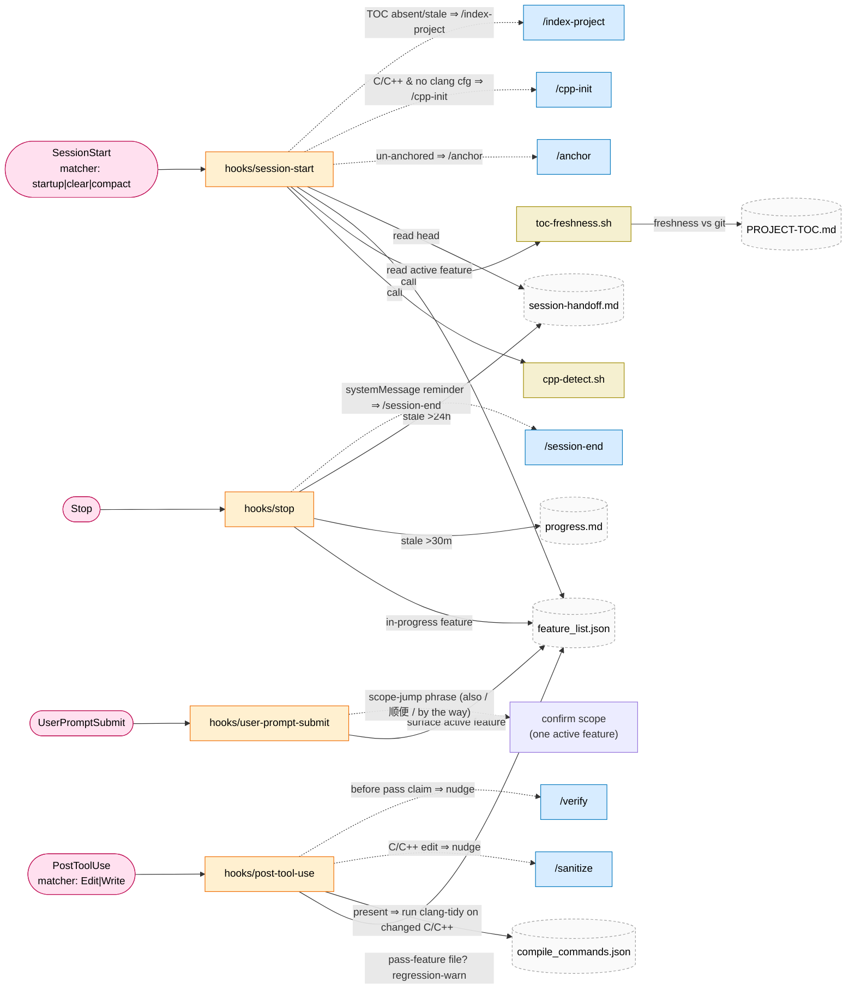
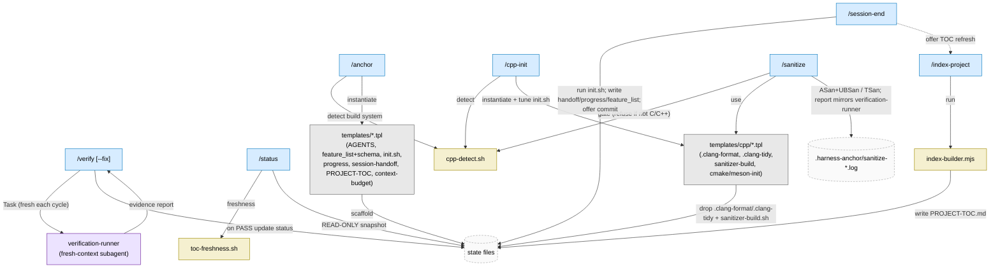
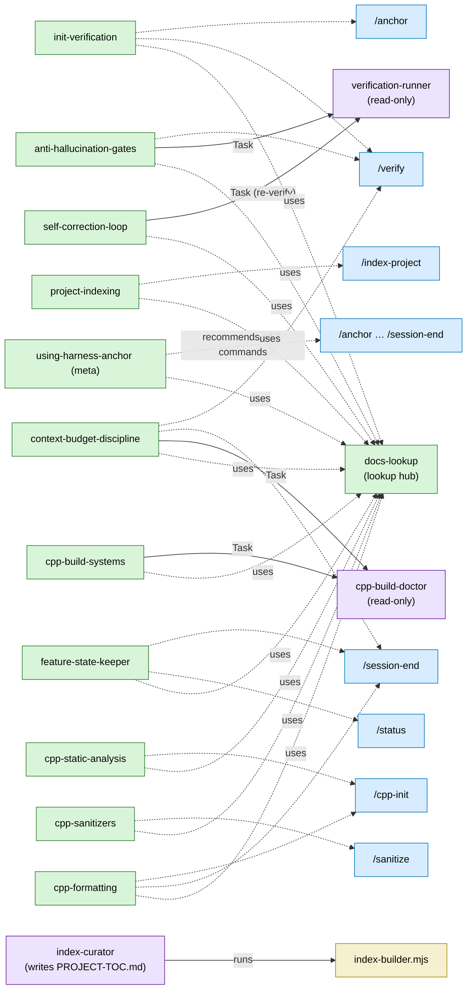
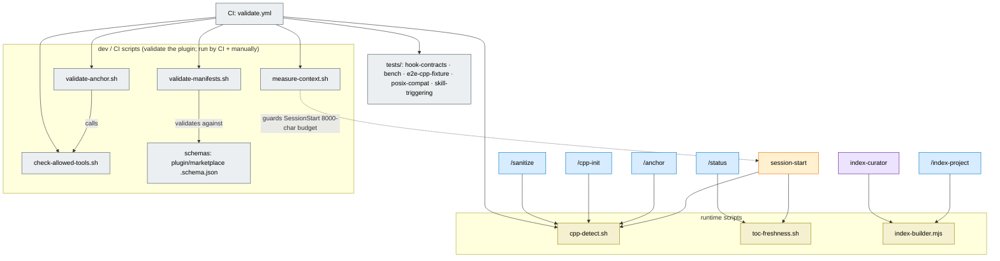

<!-- doc-align: 9801eacb02d6fd316829be3b56b8af1bc31cc809 · 2026-06-03 · harness-anchor v0.3.2 -->
# harness-anchor — Component Relationship Graph

> **Aligned with commit** [`9801eac`](https://github.com/Redtropig/harness-anchor/commit/9801eacb02d6fd316829be3b56b8af1bc31cc809) (harness-anchor v0.3.2, 2026-06-03). Verified against the plugin sources — `hooks/`, `commands/`, `skills/`, `agents/`, `scripts/`, `templates/` — at this commit; re-verify and bump this marker if they change.

How the plugin's components (**hooks · commands · skills · agents · scripts · templates**) call
and trigger one another, with **trigger conditions**, **effects**, and the **state/info** each
needs. Diagrams are [Mermaid](https://mermaid.js.org) (render on GitHub).

## The one idea to hold onto

harness-anchor has **three invocation modes** that all converge on **one shared state substrate**
(per-project files on disk):

| Mode | Who fires it | Examples | Can it write state? |
|---|---|---|---|
| ① **Automatic** | Claude Code *events* → warn-only hooks | SessionStart, PostToolUse, Stop, UserPromptSubmit | **No** — hooks only *read* state + *recommend* commands |
| ② **Model-pulled** | the agent *auto-loads* a skill by its description; a skill may dispatch a subagent via `Task` | 12 skills, 3 agents | Agents: only `index-curator` writes (`PROJECT-TOC.md`); the rest are read-only |
| ③ **User-invoked** | the user types a *slash command* | `/anchor` … `/session-end` | **Yes** — commands are the main writers |

Hooks are deliberately "dumb": they detect a situation and *nudge* the user toward a command or
surface context. The actual work (writing state, running tools, sanitizers) lives in **commands**
and **subagents**. This keeps every hook **warn-only and ≤ 5 s** (design invariants #1, #7).

### Legend

- **Solid arrow** = direct call / invoke / write.
- **Dashed arrow** = warn-only *recommendation* (the component only suggests; the user/agent acts).

---

## 1 · Master overview

---

## 2 · Automatic layer — the 4 hooks

All four are registered in `hooks/hooks.json`, dispatched through `hooks/run-hook.cmd`, and are
**warn-only**: they emit `additionalContext` (or `systemMessage` for Stop) and **never block**.

| Hook | Fires on (trigger) | Reads (info) | Effect | Recommends |
|---|---|---|---|---|
| **session-start** | session `startup`/`clear`/`compact` | `plugin.json` (version), `feature_list.json`, `session-handoff.md`, `PROJECT-TOC.md` (via `toc-freshness.sh`), project type (via `cpp-detect.sh`), `.clang-format`/`.clang-tidy` | injects `<harness-anchor-state>` banner **+ the `using-harness-anchor` meta-skill body** (`additionalContext`, budget ≤ 2000 tok) | `/anchor` (un-anchored) · `/cpp-init` (C/C++, anchored, no clang cfg — v0.3.1) · `/index-project` (TOC absent/stale) |
| **post-tool-use** | after **Edit/Write** | `feature_list.json` (pass-feature file list), `compile_commands.json` (presence) | `additionalContext` warning: regression-warn if a *passed* feature's file changed; **clang-tidy** on the changed C/C++ file when `compile_commands.json` exists | `/sanitize` (one-line nudge on C/C++ edit) · `/verify` (before a pass claim) |
| **stop** | agent about to stop | `feature_list.json`, `progress.md` (mtime), `session-handoff.md` (mtime) | **`systemMessage`** wrap-up reminder *(v0.3.2 — was the invalid `hookSpecificOutput`)* | `/session-end` |
| **user-prompt-submit** | every user prompt | `feature_list.json` (active feature) | `additionalContext` scope-check | confirm scope before pivoting (one-active-feature) |

---

## 3 · User-invoked layer — the 7 commands

Commands are the **writers**. They call runtime scripts, instantiate templates, dispatch the
`verification-runner` subagent, and update the state files. (`allowed-tools` from each command's
frontmatter shown in the table.)

| Command | Invoke when | Calls / dispatches | Writes (effect) | Guards / refuses |
|---|---|---|---|---|
| **/anchor** | project un-anchored (no `feature_list.json`) | `cpp-detect.sh`; instantiates **base templates** | scaffolds `AGENTS.md`, `feature_list.json`(+schema), `init.sh`, `progress.md`, `session-handoff.md`, `PROJECT-TOC.md`, `context-budget.md` | overwrites only with explicit approval |
| **/cpp-init** | C/C++ project, **after** `/anchor`, no clang cfg | `cpp-detect.sh`; instantiates `templates/cpp/*` | drops `.clang-format`, `.clang-tidy`, `scripts/sanitizer-build.sh`; tunes `init.sh` | asks before overwriting existing clang cfg; refuses on non-C/C++ |
| **/index-project** | `PROJECT-TOC.md` absent/stale, or before a broad search | `scripts/index-builder.mjs` (bootstraps from `PROJECT-TOC.md.tpl`) | rewrites `PROJECT-TOC.md` with a git-commit freshness anchor | errors if not a git repo |
| **/verify** `[--fix]` | before claiming a feature passes | **Task → `verification-runner`** (fresh context each cycle) | on PASS, updates `feature_list.json` status+evidence (via `feature-state-keeper`) | `--fix` bounded to **≤ 2** cycles; never self-grades; Default-FAIL (#8) |
| **/sanitize** | after a C/C++ change / before merge | `cpp-detect.sh`; `templates/cpp/sanitizer-build.sh.tpl` | runs ASan+UBSan (TSan separately) → `.harness-anchor/sanitize-*.log`; report mirrors `verification-runner` | refuses on non-C/C++ (via `cpp-detect.sh`); heavy ⇒ command, never a hook (#7) |
| **/status** | "where am I / what's the state?" | `toc-freshness.sh` | **nothing — read-only** snapshot (active feature, counts, git tree, TOC freshness, handoff head) | — |
| **/session-end** | at a stopping point | runs `init.sh` | overwrites `session-handoff.md`; prepends `progress.md`; updates `feature_list.json`; offers TOC refresh + commit | refuses `status=pass` without evidence (Default-FAIL); suggests `/anchor` if un-anchored |

---

## 4 · Model-pulled layer — skills & agents

Skills **auto-load by description** (the model "pulls" them). They don't call each other
directly; they (a) all reference **`docs-lookup`** as the canonical lookup procedure (invariant
#9), (b) *recommend* commands at the right moment, and (c) dispatch read-only **subagents** via
`Task` for fresh-context work.

### Skills

| Skill | Auto-triggers when | Recommends | Dispatches | Touches |
|---|---|---|---|---|
| **using-harness-anchor** (meta) | every session (injected by SessionStart) | **all 7 commands** | — | navigation: `AGENTS.md`, `feature_list.json`, `PROJECT-TOC.md`, `session-handoff.md` |
| **project-indexing** | locating files / understanding structure | `/index-project` | — | reads `PROJECT-TOC.md` before Glob |
| **feature-state-keeper** | start/advance/finish/block a feature | `/session-end`, `/status` | — | writes `feature_list.json`, `progress.md`, `session-handoff.md` |
| **init-verification** | start of work; after env change; something breaks | `/anchor`, `/verify` | — | runs `init.sh` |
| **self-correction-loop** | a hook/tool returns a warning, lint/type/build error, test failure | — | `verification-runner` | re-verify after fix |
| **anti-hallucination-gates** | before claiming "done/fixed/passing" | `/verify` | `verification-runner` | Default-FAIL evidence contract |
| **context-budget-discipline** | long sessions, subagents, large fetches | `/verify`, `/session-end` | `cpp-build-doctor` | `context-budget.md` |
| **docs-lookup** | unfamiliar tool/API/error/library | — (is itself the hub) | — | Context7 → WebSearch → calibrated-uncertainty |
| **cpp-build-systems** | C/C++ configure/build errors, `compile_commands.json` | — | `cpp-build-doctor` | build dir, `compile_commands.json` |
| **cpp-static-analysis** | reviewing C/C++ changes / hunting bugs | `/cpp-init` | — | needs `compile_commands.json`; `.clang-tidy` |
| **cpp-formatting** | C/C++ formatting | `/cpp-init`, `/session-end` | — | `.clang-format` (changed-lines only) |
| **cpp-sanitizers** | crashes / UB / races / memory errors | `/sanitize` | — | — |

### Agents (subagents — invoked via `Task`, single-level)

| Agent | Dispatched by | Tools | Effect |
|---|---|---|---|
| **verification-runner** | `/verify` (and re-used by `/sanitize`'s report shape, `anti-hallucination-gates`, `self-correction-loop`) | `Read, Bash, Grep, Glob` (read-only) | fresh-context build/test/lint → `### Build / Tests / Verdict / Recommendation` evidence report |
| **cpp-build-doctor** | `cpp-build-systems`, `context-budget-discipline` skills (when a C/C++ build fails) | `Read, Bash, Grep, Glob` (read-only) | diagnoses root cause from compiler output |
| **index-curator** | model-pulled by description (TOC needs rebuild: refactors/renames/`toc_stale`) | `Read, Bash, Grep, Glob, Write` | runs `index-builder.mjs`; **sole agent that writes `PROJECT-TOC.md`** |

---

## 5 · Scripts

**Runtime** scripts are called by hooks/commands/agents during a session. **Dev/CI** scripts
validate the plugin itself (run by `.github/workflows/validate.yml` and manually); they are *not*
part of the per-session call graph.

| Script | Kind | Called by | Purpose |
|---|---|---|---|
| `cpp-detect.sh` | runtime | session-start hook, `/anchor`, `/cpp-init`, `/sanitize` | detect build system (CMake/Meson/Make/Bazel) — the C/C++ gate (invariant #5) |
| `toc-freshness.sh` | runtime | session-start hook, `/status` | compare `PROJECT-TOC.md` anchor commit vs HEAD |
| `index-builder.mjs` | runtime | `/index-project`, `index-curator` agent | scan `git ls-files`, build `PROJECT-TOC.md`; writes `.harness-anchor/last-error.log` on failure |
| `validate-anchor.sh` | dev/CI | CI, manual | plugin self-consistency (skills/commands/agents/templates/hooks); calls `check-allowed-tools.sh` |
| `validate-manifests.sh` | dev/CI | CI, manual | `plugin.json`/`marketplace.json` shape + version sync (uses `schemas/`) |
| `check-allowed-tools.sh` | dev/CI | `validate-anchor.sh`, CI | every `commands/*.md` declares a well-shaped `allowed-tools:` |
| `measure-context.sh` | dev/CI | CI, manual | SessionStart output vs the 8000-char budget (invariant #2) |

---

## 6 · Templates → output

Templates are inert `.tpl` files instantiated into per-project state by `/anchor` and `/cpp-init`.

| Template | Instantiated by | → Output (in the user's project) |
|---|---|---|
| `AGENTS.md.tpl` | `/anchor` | `AGENTS.md` (operating manual) |
| `feature_list.json.tpl` + `feature_list.schema.json` | `/anchor` | `feature_list.json` |
| `init.sh.tpl` | `/anchor` (tuned by `/cpp-init`) | `init.sh` |
| `progress.md.tpl` | `/anchor` | `progress.md` |
| `session-handoff.md.tpl` | `/anchor` | `session-handoff.md` |
| `PROJECT-TOC.md.tpl` | `/anchor`, `/index-project` (bootstrap) | `PROJECT-TOC.md` |
| `context-budget.md.tpl` | `/anchor` | `context-budget.md` |
| `cpp/.clang-format.tpl` | `/cpp-init` | `.clang-format` |
| `cpp/.clang-tidy.tpl` | `/cpp-init` | `.clang-tidy` |
| `cpp/sanitizer-build.sh.tpl` | `/cpp-init` (used by `/sanitize`) | `scripts/sanitizer-build.sh` |
| `cpp/cmake-init.sh.tpl`, `cpp/meson-init.sh.tpl` | `/cpp-init` | build-system-specific `init.sh` tuning |

---

## 7 · Shared state substrate — who writes, who reads

The state files are the **integration bus**: hooks read them to decide what to nudge; commands
and `feature-state-keeper` write them; agents read them for ground truth. All are git-tracked by
default **except `.harness-anchor/`** (runtime logs — the only gitignored path, invariant #4).

| State file | Written by | Read by |
|---|---|---|
| `feature_list.json` | `/anchor`, `/verify`, `/session-end`, `feature-state-keeper` | **all 4 hooks**, `/status`, `feature-state-keeper` |
| `progress.md` | `/anchor`, `/session-end`, `feature-state-keeper` | `stop` hook |
| `session-handoff.md` | `/anchor`, `/session-end` | `session-start` hook, `stop` hook, `/status` |
| `PROJECT-TOC.md` | `/index-project`, `index-curator` | `session-start` (via `toc-freshness.sh`), `project-indexing`, `/status` |
| `AGENTS.md` | `/anchor` | `using-harness-anchor` (navigation), subagents |
| `init.sh` | `/anchor` (tuned by `/cpp-init`) | `init-verification`, `/verify`, `/session-end` |
| `context-budget.md` | `/anchor` | `context-budget-discipline` |
| `.clang-format` / `.clang-tidy` | `/cpp-init` | `cpp-formatting`, `cpp-static-analysis`, `post-tool-use` (clang-tidy) |
| `compile_commands.json` | the project build (guided by `cpp-build-systems`) | `post-tool-use` (clang-tidy gate), `cpp-static-analysis` |
| `.harness-anchor/` (logs) | `index-builder.mjs`, `/sanitize` | humans / debugging (gitignored) |

---

## Design invariants the graph enforces

1. **Warn-only hooks** — every hook→command edge is *dashed* (a recommendation); no hook writes state or blocks.
2. **SessionStart ≤ 2000 tokens** — `measure-context.sh` guards the banner+meta-skill injection.
3. **Single-level subagents** — agents are leaf nodes (no agent→agent edges); each is dispatched by a command or skill, never from within another subagent.
4. **State is git-tracked except `.harness-anchor/`** — see §7.
5. **C/C++ gated by `cpp-detect.sh`** — every C/C++ command/skill routes through it.
6. *(Skill descriptions front-load trigger keywords — an authoring rule from CLAUDE.md, not something the call graph expresses; kept here only to preserve the canonical numbering.)*
7. **Hooks ≤ 5 s, fail-silent** — heavy work (`/sanitize`, `/verify --fix`) is a *command*, never a hook.
8. **Default-FAIL** — `/verify` → `verification-runner` (read-only, fresh context) is the only path to `status=pass`.
9. **docs-lookup is canonical** — every skill funnels lookups through it (§4).

*Generated for harness-anchor v0.3.2. Source of truth: `hooks/`, `commands/`, `skills/`, `agents/`, `scripts/`, `templates/`.*
